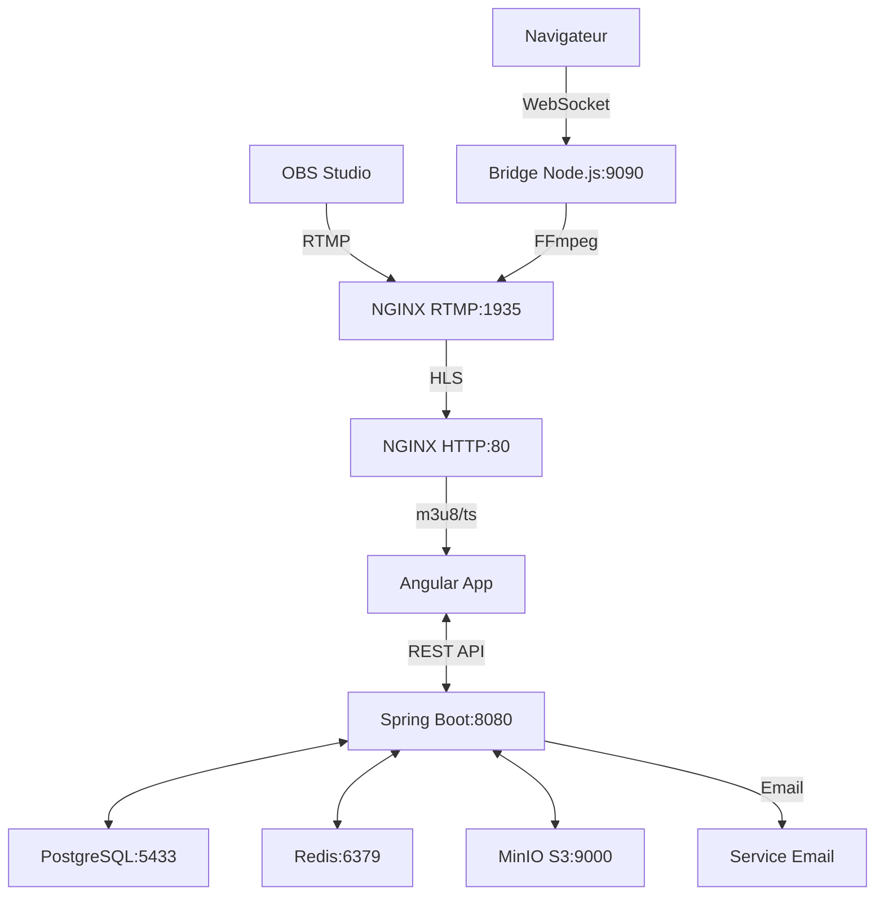

# Architecture de Live Streaming - DarQuran

## Vue d'ensemble de l'Architecture

Le système de live streaming DarQuran utilise une architecture moderne basée sur les protocoles RTMP/HLS, permettant la diffusion de cours en direct pour une plateforme d'apprentissage du Coran.

## Components Principaux

### 1. Backend (Spring Boot)
- **API REST** : Gestion des sessions de live, commentaires, authentification
- **Base de données** : PostgreSQL pour la persistance des sessions et métadonnées
- **Cache** : Redis pour les sessions utilisateurs et cache
- **Security** : JWT + gestion des rôles (ADMIN, ENSEIGNANT, ELEVE)
- **Notifications** : Envoi d'emails automatiques au démarrage des lives

### 2. Infrastructure de Streaming
- **NGINX RTMP** : Serveur de streaming principal
- **Bridge WebSocket** : Service optionnel pour streaming navigateur
- **MinIO** : Stockage S3-compatible pour enregistrements
- **FFmpeg** : Transcodage vidéo (dans le bridge)

### 3. Frontend (Angular)
- **Player HLS** : Lecture des streams en temps réel
- **Interface Chat** : Commentaires en direct
- **Gestion des permissions** : Accès selon les sections/rôles

## Protocoles et Technologies

### Ingestion (Entrée)
- **RTMP** : OBS Studio → NGINX RTMP Server (Port 1935)
- **WebSocket + FFmpeg** : Navigateur → Bridge → RTMP (Port 9090)

### Diffusion (Sortie)
- **HLS** : NGINX → Navigateurs (Port 8081)
- **M3U8 + TS segments** : Streaming adaptatif

### API & Data
- **REST API** : Spring Boot (Port 8080)
- **WebSocket** : Commentaires temps réel
- **PostgreSQL** : Métadonnées (Port 5433)
- **Redis** : Cache & sessions (Port 6379)

## Types d'Accès

### 1. EXTERNAL (Public)
- Accessible à tous sans authentification
- Utilisé pour les cours publics

### 2. INTERNAL (Privé)
- Nécessite authentification
- Restriction par section (HOMME/FEMME)
- Seuls les utilisateurs de la même section peuvent accéder

## Workflow Complet - Étape par Étape

### Phase 1: Préparation du Live (Backend)

```
1. CREATION DE SESSION
   ├─ Enseignant/Admin crée une session via API
   ├─ POST /api/live/sessions
   ├─ Génération d'une streamKey unique
   ├─ Configuration HLS URL: /hls/{streamKey}.m3u8
   ├─ Statut: SCHEDULED
   └─ Persistance en base (PostgreSQL)

2. CONFIGURATION AUTOMATIQUE
   ├─ Section héritée du professeur
   ├─ AccessType défini (INTERNAL/EXTERNAL)
   └─ URLs générées (RTMP ingestion + HLS playback)
```

### Phase 2: Démarrage du Streaming

#### Option A: Via OBS Studio (Recommandé)
```
1. CONFIGURATION OBS
   ├─ URL RTMP: rtmp://localhost:1935/live
   ├─ StreamKey: récupérée via API
   └─ Codec: H.264 + AAC

2. INGESTION RTMP → NGINX
   ├─ OBS pousse le flux vers NGINX:1935
   ├─ NGINX reçoit le flux RTMP
   ├─ Application: /live/{streamKey}
   └─ Début conversion temps réel

3. CONVERSION HLS AUTOMATIQUE
   ├─ NGINX génère segments .ts (1 seconde)
   ├─ Création playlist .m3u8
   ├─ Stockage: /tmp/hls/{streamKey}/
   └─ Disponibilité immédiate pour lecture
```

#### Option B: Via Navigateur (Bridge WebSocket)
```
1. CAPTURE NAVIGATEUR
   ├─ MediaRecorder API (WebM)
   ├─ getUserMedia() pour caméra/micro
   └─ Chunks WebM générés

2. ENVOI VIA WEBSOCKET
   ├─ Connexion: ws://localhost:9090
   ├─ Message config: {"type":"config","streamKey":"xxx"}
   ├─ Envoi chunks binaires WebM
   └─ Bridge Node.js réceptionne

3. TRANSCODAGE FFMPEG
   ├─ Bridge spawns FFmpeg
   ├─ WebM stdin → H.264/AAC
   ├─ Sortie FLV vers RTMP
   └─ NGINX reçoit et convertit en HLS
```

### Phase 3: Activation du Live

```
1. DEMARRAGE API (POST /api/live/sessions/{id}/start)
   ├─ Vérification des droits utilisateur
   ├─ Mise à jour statut: SCHEDULED → LIVE
   ├─ Timestamp startedAt enregistré
   └─ Déclenchement notifications

2. NOTIFICATIONS AUTOMATIQUES
   ├─ Règles selon le rôle du lanceur:
   │  ├─ SUPER_ADMIN → tous les utilisateurs
   │  └─ ADMIN_SECTION/ENSEIGNANT → même section uniquement
   ├─ Construction email avec lien frontend
   ├─ Envoi en masse via EmailService
   └─ Log du nombre de destinataires
```

### Phase 4: Diffusion et Visualisation

```
1. ACCES FRONTEND
   ├─ GET /api/live/sessions (liste des lives)
   ├─ Filtrage selon les droits:
   │  ├─ Public: EXTERNAL seulement
   │  ├─ Authentifié: INTERNAL + même section
   │  └─ Admin: tous accès
   └─ URL HLS récupérée

2. LECTURE VIDEO (HLS)
   ├─ Player charge: http://localhost:8081/hls/{streamKey}.m3u8
   ├─ NGINX sert les fichiers via HTTP:80(/hls)
   ├─ Headers CORS configurés pour Angular
   ├─ Adaptive bitrate automatique
   └─ Latence: ~3-10 secondes

3. COMMENTAIRES TEMPS REEL
   ├─ GET /api/live/sessions/{id}/comments
   ├─ POST /api/live/sessions/{id}/comments
   ├─ Authentifiés: nom utilisateur auto
   ├─ Publics: authorDisplayName requis
   └─ Persistance PostgreSQL + fetch périodique
```

### Phase 5: Gestion durant le Live

```
1. MONITORING AUTOMATIQUE
   ├─ NGINX génère stats RTMP
   ├─ Backend surveille les statuts sessions
   └─ Logs FFmpeg dans le bridge

2. CONTROLES ADMIN
   ├─ PUT /api/live/sessions/{id} (modification)
   ├─ POST /api/live/sessions/{id}/end (arrêt)
   ├─ DELETE /api/live/sessions/{id} (suppression)
   └─ Réservé aux ADMIN/ENSEIGNANT

3. ENREGISTREMENT (Optionnel)
   ├─ Flag recordingEnabled par session
   ├─ NGINX peut enregistrer en MP4
   ├─ Upload vers MinIO S3
   └─ URL enregistrement dans recordingUrl
```

### Phase 6: Fin de Session

```
1. ARRET STREAMING
   ├─ Streamer stoppe OBS/navigateur
   ├─ Connexion RTMP fermée
   ├─ Segments HLS restent disponibles brièvement
   └─ Auto-cleanup par NGINX

2. CLOTURE API (POST /api/live/sessions/{id}/end)
   ├─ Statut: LIVE → ENDED
   ├─ Timestamp endedAt enregistré
   ├─ Stats finales sauvegardées
   └─ Nettoyage ressources temporaires

3. POST-TRAITEMENT
   ├─ Enregistrement transféré vers MinIO
   ├─ URL finalisée dans recordingUrl
   ├─ Notifications fin possibles
   └─ Archivage métadonnées
```

## Sécurité et Permissions

### Authentification
- **JWT Tokens** : Validation côté Spring Security
- **Rôles hiérarchiques** : SUPER_ADMIN > ADMIN_SECTION > ENSEIGNANT > ELEVE

### Autorisation par Action

#### Création/Modification/Démarrage Live
- ✅ **SUPER_ADMIN** : Tous droits, peut spécifier userId
- ✅ **ADMIN_SECTION** : Tous droits dans sa section
- ✅ **ENSEIGNANT** : Devient automatiquement l'animateur
- ❌ **ELEVE** : Lecture seule

#### Accès aux Lives
- **EXTERNAL** : Accessible à tous (même non-auth)
- **INTERNAL** : Authentification requise + même section
- **Validation** : Côté controller + service layer

#### Commentaires
- **Authentifiés** : Nom automatique depuis token
- **Publics** : authorDisplayName obligatoire
- **Modération** : Pas implémentée (TODO)

## Architecture Technique Détaillée

### Flux de Données



### Performance et Scalabilité

#### Optimisations HLS
- **Fragment size** : 1 seconde (faible latence)
- **Playlist length** : 4 segments (mémoire optimisée)
- **Adaptive quality** : Géré côté player
- **CORS** : Headers permissifs pour multi-domaines

#### Limitations Actuelles
- **Single server** : Pas de load balancing RTMP
- **Shared storage** : /tmp local, pas distribué
- **No CDN** : Diffusion directe depuis NGINX
- **Basic monitoring** : Logs seulement

#### Pistes d'Amélioration
- **RTMP Load Balancer** : nginx-rtmp-module clustering
- **Shared storage** : NFS ou S3 pour segments HLS
- **CDN Integration** : CloudFlare, AWS CloudFront
- **Advanced monitoring** : Prometheus + Grafana
- **Transcoding cluster** : Multiple quality levels

## Configuration et Déploiement

### Variables d'Environnement Clés

```env
# Streaming URLs (adapter selon l'environnement)
HLS_BASE_URL=http://localhost:8081/hls
RTMP_SERVER_URL=rtmp://localhost:1935/live

# Frontend pour les liens email
FRONT_URL=https://darquran.example.com

# Stockage enregistrements
S3_ENABLED=true
S3_ENDPOINT=http://minio:9000
S3_BUCKET=darquran-media
```

### Ports Exposés

| Service | Port | Protocole | Description |
|---------|------|-----------|-------------|
| Spring Boot | 8080 | HTTP | API REST |
| NGINX RTMP | 1935 | RTMP | Ingestion OBS |
| NGINX HTTP | 8081 | HTTP | Diffusion HLS |
| Bridge WS | 9090 | WebSocket | Streaming navigateur |
| PostgreSQL | 5433 | TCP | Base données |
| Redis | 6379 | TCP | Cache |
| MinIO | 9000 | HTTP | Stockage S3 |
| MinIO Console | 9001 | HTTP | Interface admin |

### Commandes Docker

```bash
# Démarrage complet
docker-compose up -d

# Avec bridge WebSocket
docker-compose --profile with-bridge up -d

# Reconstruction après changements
docker-compose build --no-cache backend
docker-compose up -d backend
```

## Troubleshooting

### Problèmes Fréquents

#### Live ne démarre pas
1. Vérifier stream key unique
2. Contrôler connexion RTMP vers NGINX
3. Valider permissions utilisateur
4. Consulter logs Spring Boot

#### Pas de flux HLS
1. Vérifier segments dans `/tmp/hls/{streamKey}/`
2. Tester URL directe : `http://localhost:8081/hls/{streamKey}.m3u8`
3. Contrôler headers CORS
4. Vérifier codec OBS (H.264 requis)

#### Bridge WebSocket échoue
1. FFmpeg installé et dans PATH
2. Port 9090 disponible
3. Connexion vers NGINX RTMP fonctionnelle
4. Format WebM supporté par navigateur

### Logs Utiles

```bash
# Spring Boot
docker-compose logs -f backend

# NGINX RTMP
docker-compose logs -f media-server

# Bridge WebSocket
docker-compose logs -f streaming-bridge

# Base données
docker-compose logs -f postgres
```

## Monitoring et Métriques

### KPIs à Surveiller
- **Concurrent viewers** par session
- **Latence HLS** bout-en-bout
- **Débit RTMP** ingestion
- **Taille segments** et playlist
- **Errors rate** connexions
- **Storage usage** MinIO

### Outils Recommandés
- **Application monitoring** : Spring Boot Actuator
- **Infrastructure** : Docker stats
- **Streaming** : NGINX RTMP stat module
- **Alerting** : Email via EmaiService existant

---

Cette architecture garantit une solution de live streaming robuste et scalable, adaptée aux besoins éducatifs de DarQuran avec une gestion fine des permissions et de la sécurité.